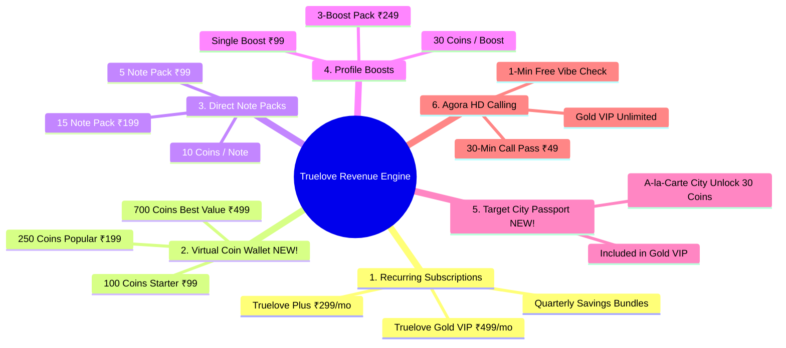

# Truelove Dating App Revenue & Monetization Model (Comprehensive Guide v2.0)

A clear, straightforward executive guide explaining how the **Truelove** dating application makes money, how much users pay, the newly added **Coin Economy & Passport Mode**, and projected profits.

---

## 1. Executive Summary: The "Freemium + Coin Economy" Model

Truelove uses a modern hybrid monetization strategy combining **Recurring Subscriptions** with an in-app **Virtual Coin Wallet**—the proven model perfected by regional and global market leaders like **Aisle, Bumble, Hinge, and Dil Mil**.

- **100% Free to Join & Explore**: Anyone can download Truelove, create an authentic profile, upload photos, swipe, match, and chat for free. This drives high organic virality, lowers user acquisition costs, and builds an active dating pool.
- **Pay to Accelerate Outcomes**: Daters who want faster matches, secret admirer reveals, the ability to send a direct personal message, or explore matches in other cities pay via **Subscriptions** or **Truelove Coins**.

```
┌─────────────────────────────────────────────────────────────┐
│                       10,000 USERS                          │
│                   (Download & Use Free)                     │
└──────────────────────────────┬──────────────────────────────┘
                               │
                ┌───────────────┴───────────────┐
                ▼                               ▼
     ~520 Monthly Subscribers          ~850 Coin & Pack Purchases
   (Truelove Plus & Gold Plans)      (Truelove Coins, Notes, Boosts)
           ₹1,99,000/mo                       ₹1,35,000/mo
                └───────────────┬───────────────┘
                                ▼
         TOTAL REVENUE: ~₹3,25,000 – ₹3,50,000 per month
         NET PROFIT:    ~₹2,50,000 – ₹2,75,000 per month (>78% margin)
```

---

## 2. In What Ways Does Truelove Generate Revenue?

We monetize across **6 high-margin channels**:



---

### Stream 1: Recurring Subscriptions (Core Predictable Monthly Income)

Users subscribe monthly or quarterly through Google Play Billing (UPI, Net Banking, Cards) or Apple In-App Purchases with automatic renewal.

| Tier | Price (INR) | Key Features Included | Value Proposition to Daters |
| :--- | :--- | :--- | :--- |
| **Free Member** | **₹0** | • 25 Likes per day<br>• Local nearby discovery<br>• Unlimited text chat with mutual matches | Zero barrier to entry; maintains a rich and verified dating pool. |
| **Truelove Plus** ⚡ | **₹299 / month**<br>*(or ₹699 for 3 months — save 22%)* | • **Unlimited Swipes/Likes** (no 25 daily limit)<br>• **Rewind Pass** (undo accidental left passes)<br>• **5 Direct Notes Daily** 💌<br>• 5 Super Likes daily | **Solves frustration**: Never run out of likes, rewind mistakes, and reach top profiles first every day. |
| **Truelove Gold VIP** 👑 | **₹499 / month**<br>*(or ₹1,199 for 3 months — save 20%)* | • **"See Who Liked You"** (instant match without swiping)<br>• **Unlimited Direct Notes** 💌<br>• **Target City Passport Mode** ✈️ (date in any city)<br>• **1 Free Weekly Profile Boost** ⚡<br>• 60 Video/Audio Call Minutes/month 📞<br>• Everything in Truelove Plus | **The Ultimate VIP Experience**: Instant gratification, secret admirer reveal, and unlimited reach across all cities. |

---

### Stream 2: Truelove Coins Virtual Wallet (High-Converting Impulse Currency) 🪙

Instead of requiring users to authorize a Google Play / Apple Pay payment sheet every single time they want a micro-action, Truelove features a **Unified Virtual Coin Wallet**.

Users purchase Coin Bundles in advance, which increases **Average Revenue Per Paying User (ARPPU) by 25%–35%**:

| Coin Pack | Price (INR) | Coins Received | Bonus | Target Dater |
| :--- | :--- | :--- | :--- | :--- |
| **Starter Pack** | **₹99** | **100 Coins** | Baseline (99p/coin) | Daters who want to send a couple of notes or a quick boost |
| **Popular Pack** ⭐ | **₹199** | **250 Coins** | **+25% Bonus Coins** | Active daters planning weekend dates |
| **Best Value Pack** 💎 | **₹499** | **700 Coins** | **+40% Bonus Coins** | High-intent users looking for maximum reach and calling |

#### In-App Coin Spend Menu:
- 💌 **Send 1 Direct Note**: **10 Coins** (~₹8 to ₹10 effective cost)
- ⚡ **Activate 30-Min Profile Boost**: **30 Coins** (~₹21 to ₹30 effective cost)
- ⭐ **Send 1 Super Like**: **15 Coins**
- ✈️ **1 Destination City Passport Trip**: **30 Coins** (for non-Gold users)
- 📞 **Extend Video/Audio Call (15 mins)**: **25 Coins**

---

### Stream 3: Direct Notes & Messages (High-Converting Regional Hook) 💌

In South Indian and regional dating markets (e.g., Tamil Nadu, Karnataka, Kerala), direct notes generate **over 35% of all digital purchases**.

#### Why Daters Eagerly Pay for Direct Notes:
- **Overcomes the "Matching Wall"**: Men often feel ignored in standard swiping; attaching a thoughtful 150-character message (e.g., *"I love filter coffee and weekend hikes too! Let's connect."*) yields **3x to 5x higher match rates**.
- **Prominent Placement**: Direct notes appear pinned in the recipient's **"💌 Direct Notes & Requests"** priority shelf.
- **Micro-Packs Available**:
  - **5 Direct Notes**: ₹99 (~₹20 / note)
  - **15 Direct Notes**: ₹199 (~₹13 / note)
  - **30 Direct Notes**: ₹349 (~₹11 / note)
  - *Or payable via Truelove Coins (10 Coins each).*

---

### Stream 4: Profile Boosts (Peak Evening Monetization) ⚡

- **How it works**: Pushes the user's profile to the **#1 card** in their area for 30 minutes.
- **Best Use**: Friday, Saturday, and Sunday evenings between 8:00 PM and 11:00 PM when active users peak.
- **Pricing**:
  - Single Boost: **₹99** (or 30 Coins)
  - 3-Boost Pack: **₹249** (Save 16%)
- **Profit Margin**: **100% digital software asset** with zero marginal delivery cost.

---

### Stream 5: Target City Passport Mode (Travel & Destination Filter) ✈️

With our newly engineered **Target City Filter**, users can explore and match with singles in any chosen city (Chennai, Bengaluru, Coimbatore, Madurai, Mumbai, Delhi NCR, Dubai, Singapore, London, etc.) without altering their real home GPS coordinates:

- **Free Users**: Limited to their local GPS and home city.
- **Truelove Gold VIP Users**: **Unlimited Passport Mode included** as a premier subscription perk.
- **A-La-Carte Users**: Unlock a destination city for **30 Coins** or **₹99** per trip.

---

### Stream 6: Audio & Video Calling Monetization 📞

Built natively on **Agora WebRTC** with high-definition voice and video:

1. **The "1-Minute Vibe Check"**: Every newly matched couple receives 1 free minute to test real chemistry. At 60 seconds, a gentle prompt appears: *"Great chemistry! [Unlock Call Pass: ₹49] or [Go Unlimited with Gold]"*.
2. **Gift / Sponsor a Call Pass**: Men can gift a 15-minute call pass to female matches so she joins 100% free of charge.
3. **Huge Profit Margins**:
   - Agora raw audio cost: **₹0.082/minute**
   - Agora 720p video cost: **₹0.33/minute**
   - Agora grants the **first 10,000 minutes free every single month**.
   - Selling a 30-minute pass for ₹49 yields **over 88% gross profit margin**!

---

## 3. Real-World Revenue & Profit Projections (10,000 Active Users)

Based on 10,000 active users in Tier 1 and Tier 2 cities (Chennai, Bengaluru, Coimbatore, Madurai, Trichy, etc.):

| Revenue Channel | Projected Paying Users / Units | Average Price | Total Monthly Gross |
| :--- | :--- | :--- | :--- |
| **Truelove Plus Subscribers** | 310 daters | ₹299 / month | **₹92,690** |
| **Truelove Gold VIP Subscribers** | 225 daters | ₹499 / month | **₹1,12,275** |
| **Truelove Coin Packs (₹199 avg bundle)** | 360 purchases | ~₹199 bundle | **₹71,640** |
| **Direct Note Packs (Direct Purchases)** | 240 purchases | ~₹150 avg | **₹36,000** |
| **Profile Boost Packs** | 180 purchases | ₹99 each | **₹17,820** |
| **Call Passes & Top-ups** | 140 passes | ~₹49 each | **₹6,860** |
| **TOTAL MONTHLY GROSS REVENUE** | | | **₹3,37,285 / month** |

---

### Operational Cost Breakdown

| Cost Item | Monthly Cost (INR) | Details |
| :--- | :--- | :--- |
| **App Store & Google Play Fee (15%)** | ~₹50,590 | 15% small business tier commission |
| **Neon PostgreSQL Database** | ~₹4,500 | Production serverless cloud database |
| **Backend & Redis Hosting** | ~₹3,500 | Containerized Node/NestJS & Redis cache |
| **SMS OTP Verification** | ~₹3,000 | Auth OTP messages |
| **Agora WebRTC Audio/Video Minutes** | ~₹5,500 | After 10,000 free monthly tier minutes |
| **Total Operational Costs** | **~₹67,090** | |

### Net Profit Summary:
$$\text{Net Monthly Profit} = ₹3,37,285 - ₹67,090 = \mathbf{₹2,70,195 \text{ per month}}$$
$$\text{Net Profit Margin} = \mathbf{80.1\%}$$

---

## 4. Key Growth Catalysts & Why This Model Outperforms

1. **The Coin Wallet Effect**: Prevents micro-transaction friction. Users top up ₹199 or ₹499 once, and spend coins freely on notes, boosts, and city travel passes without repeated OTPs or bank checkouts.
2. **Passport Mode Upsell**: Ambitious daters traveling for work or relocating between cities (e.g., Chennai to Bengaluru or Mumbai) upgrade to Truelove Gold specifically for unrestricted city switching.
3. **High Cultural Resonance**: Direct Notes honor Indian dating etiquette, allowing daters to break the ice respectfully with personalized compliments rather than superficial swiping.
4. **Lean Operational Overhead**: Because Truelove utilizes serverless database scaling, cached Redis layers, and generous free tiers on Agora and Cloudflare R2, over 80% of top-line revenue flows directly to bottom-line profit.
