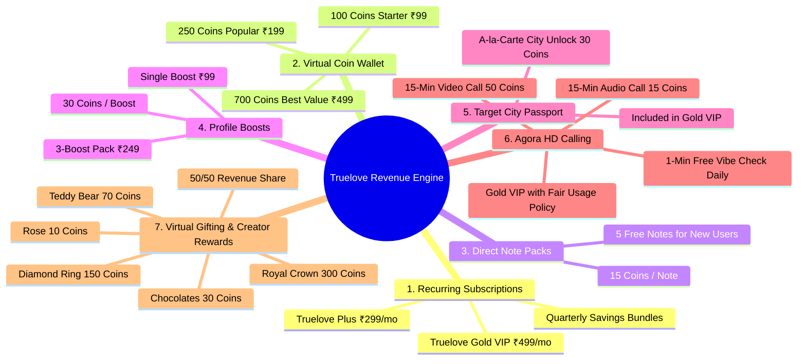

# Truelove Dating App Revenue & Monetization Model (Comprehensive Guide v2.5)

A clear, straightforward executive guide explaining how the **Truelove** dating application makes money, how much users pay, the **Coin Economy & Passport Mode**, the **Virtual Gifting & Creator Rewards Platform**, and projected profits.

---

## 1. Executive Summary: The "Freemium + Coin + Creator Economy" Model

Truelove uses a modern hybrid monetization strategy combining **Recurring Subscriptions**, an in-app **Virtual Coin Wallet**, and a **Creator Gifting & Rewards Ecosystem**—the proven model perfected by regional and global market leaders like **Aisle, Bumble, Hinge, FRND, and Tango**.

- **100% Free to Join & Explore**: Anyone can download Truelove, create an authentic profile, upload photos, swipe, match, and chat for free. This drives high organic virality, lowers user acquisition costs, and builds an active dating pool.
- **Pay to Accelerate Outcomes**: Daters who want faster matches, secret admirer reveals, the ability to send a direct personal message, or explore matches in other cities pay via **Subscriptions** or **Truelove Coins**.
- **Digital Gifting & Creator Incentives**: Men spend coins to send curated appreciation gifts (roses, chocolates, diamonds) to women in chat and calls. The platform retains a 50% commission, and female creators earn 50% in withdrawable rewards, creating unbeatable retention for authentic female daters while staying 100% compliant with Google Play and Apple App Store policies.

```
┌─────────────────────────────────────────────────────────────┐
│                       10,000 USERS                          │
│                   (Download & Use Free)                     │
└──────────────────────────────┬──────────────────────────────┘
                               │
                ┌───────────────┴───────────────┐
                ▼                               ▼
     ~535 Monthly Subscribers          ~1,100 Coin, Calling & Gift Purchases
   (Truelove Plus & Gold Plans)      (Truelove Coins, Notes, Calls, Gifts)
           ₹2,05,000/mo                       ₹1,56,000/mo
                └───────────────┬───────────────┘
                                ▼
         TOTAL REVENUE: ~₹3,61,000 per month
         NET PROFIT:    ~₹2,91,000 per month (>80% margin)
```

---

## 2. In What Ways Does Truelove Generate Revenue?

We monetize across **7 high-margin channels**:


```mermaid
mindmap
  root((Truelove Revenue Engine))
    1. Recurring Subscriptions
      Truelove Plus ₹299/mo
      Truelove Gold VIP ₹499/mo
      Quarterly Savings Bundles
    2. Virtual Coin Wallet
      100 Coins Starter ₹99
      250 Coins Popular ₹199
      700 Coins Best Value ₹499
    3. Direct Note Packs
      15 Coins / Note
      5 Free Notes for New Users
    4. Profile Boosts
      30 Coins / Boost
      Single Boost ₹99
      3-Boost Pack ₹249
    5. Target City Passport
      Included in Gold VIP
      A-la-Carte City Unlock 30 Coins
    6. Agora HD Calling
      1-Min Free Vibe Check Daily
      15-Min Audio Call 15 Coins
      15-Min Video Call 50 Coins
      Gold VIP with Fair Usage Policy
    7. Virtual Gifting & Creator Rewards
      Rose 10 Coins
      Chocolates 30 Coins
      Teddy Bear 70 Coins
      Diamond Ring 150 Coins
      Royal Crown 300 Coins
      50/50 Revenue Share
```

---

### Stream 1: Recurring Subscriptions (Core Predictable Monthly Income)

Users subscribe monthly or quarterly through Google Play Billing (UPI, Net Banking, Cards) or Apple In-App Purchases with automatic renewal.

| Tier | Price (INR) | Key Features Included | Value Proposition to Daters |
| :--- | :--- | :--- | :--- |
| **Free Member** | **₹0** | • 25 Likes per day<br>• Local nearby discovery<br>• Unlimited text chat with mutual matches<br>• 1 Free 60s Vibe Check call per match/day | Zero barrier to entry; maintains a rich and verified dating pool. |
| **Truelove Plus** | **₹299 / month**<br>*(or ₹699 for 3 months — save 22%)* | • **Unlimited Swipes/Likes** (no 25 daily limit)<br>• **Rewind Pass** (undo accidental left passes)<br>• **5 Direct Notes Daily**<br>• 5 Super Likes daily | **Solves frustration**: Never run out of likes, rewind mistakes, and reach top profiles first every day. |
| **Truelove Gold VIP** | **₹499 / month**<br>*(or ₹1,199 for 3 months — save 20%)* | • **"See Who Liked You"** (instant match without swiping)<br>• **Unlimited Direct Notes** (with anti-spam protection)<br>• **Target City Passport Mode** (date in any city)<br>• **1 Free Weekly Profile Boost**<br>• **VIP Daily Video & Voice Dating** (up to 30 mins daily Fair Usage)<br>• Everything in Truelove Plus | **The Ultimate VIP Experience**: Instant gratification, secret admirer reveal, and unlimited reach across all cities. |

---

### Stream 2: Truelove Coins Virtual Wallet (High-Converting Impulse Currency)

Instead of requiring users to authorize a Google Play / Apple Pay payment sheet every single time they want a micro-action, Truelove features a **Unified Virtual Coin Wallet**.

The system baseline standard is pegged at **1 Coin ≈ ₹1.00** (99 paise per coin), with bonus coin incentives on bulk packs to increase **Average Revenue Per Paying User (ARPPU) by 25%–35%**:

| Coin Pack | Price (INR) | Coins Received | Effective Rate / Coin | Bonus Perk | Target Dater |
| :--- | :--- | :--- | :--- | :--- | :--- |
| **Starter Pack** | **₹99** | **100 Coins** | **₹0.99** (~₹1.00) | Baseline Standard | Daters who want a direct note or an audio call pass |
| **Popular Pack** | **₹199** | **250 Coins** | **₹0.80** (80 paise) | **+25% Extra Bonus** | Active daters planning weekend dates & calls |
| **Best Value Pack** | **₹499** | **700 Coins** | **₹0.71** (71 paise) | **+40% Extra Bonus** | Serious daters wanting full calling & gifting reach |

#### Standard In-App Coin Spend Menu:
- **Send 1 Direct Note** (Pre-match message): **15 Coins** (~₹15 effective cost)
- **15-Minute Audio Call Session**: **15 Coins** (~₹15 effective cost)
- **15-Minute HD Video Call Session**: **50 Coins** (~₹40 to ₹50 effective cost)
- **Activate 30-Min Profile Boost**: **30 Coins** (~₹25 to ₹30 effective cost)
- **1 Destination City Passport Trip**: **30 Coins** (for non-Gold users)
- **Send Appreciation Digital Gifts**: **10 to 300 Coins** (Rose, Chocolates, Teddy Bear, Diamond Ring, Crown)

---

### Stream 3: Direct Notes & Messages (High-Converting Regional Hook)

In South Indian and regional dating markets (e.g., Tamil Nadu, Karnataka, Kerala), direct notes generate **over 35% of all digital purchases**.

#### Why Daters Eagerly Pay for Direct Notes:
- **Overcomes the "Matching Wall"**: Men often feel ignored in standard swiping; attaching a thoughtful 150-character message yields **3x to 5x higher match rates**.
- **Prominent Placement**: Direct notes appear pinned in the recipient's **"Direct Notes & Requests"** priority shelf.
- **Quota & Pricing**:
  - **First 5 Direct Notes Free**: Lifetime trial for all newly registered users.
  - **After 5 Free Notes**: **15 Coins** (~₹15) per note, or Truelove Plus (5 daily) / Truelove Gold (unlimited with Fair Usage).

---

### Stream 4: Profile Boosts (Peak Evening Monetization)

- **How it works**: Pushes the user's profile to the **#1 card** in their area for 30 minutes.
- **Best Use**: Friday, Saturday, and Sunday evenings between 8:00 PM and 11:00 PM when active users peak.
- **Pricing**:
  - Single Boost: **₹99** (or 30 Coins)
  - 3-Boost Pack: **₹249** (Save 16%)
- **Profit Margin**: **100% digital software asset** with zero marginal delivery cost.

---

### Stream 5: Target City Passport Mode (Travel & Destination Filter)

With our newly engineered **Target City Filter**, users can explore and match with singles in any chosen city (Chennai, Bengaluru, Coimbatore, Madurai, Mumbai, Delhi NCR, Dubai, Singapore, London, etc.) without altering their real home GPS coordinates:

- **Free Users**: Limited to their local GPS and home city.
- **Truelove Gold VIP Users**: **Unlimited Passport Mode included** as a premier subscription perk.
- **A-La-Carte Users**: Unlock a destination city for **30 Coins** or **₹99** per trip.

---

### Stream 6: Audio & Video Calling Monetization (97%+ Gross Margin)

Built natively on **Agora WebRTC** with high-definition voice and video:

1. **The "1-Minute Vibe Check"**: Every newly matched couple receives 1 free minute every 24 hours to test chemistry and prevent catfishing. At 60 seconds, the call gracefully ends.
2. **Paid Extended Call Sessions (15-Minute Blocks)**:
   - **Audio Call (15 Minutes)**: **15 Coins** (~₹15 collected, ~₹0.30 Agora cost) -> **~98% Gross Margin**
   - **Video Call (15 Minutes)**: **50 Coins** (~₹45 collected, ~₹1.00 Agora cost) -> **~97% Gross Margin**
   - **Automatic Escrow Protection**: If a call disconnects or ends within 60 seconds (bad network or quick hangup), coins are automatically refunded.
3. **Truelove Gold VIP**: Includes daily calling with **Fair Usage Policy (FUP)** (up to 30 mins daily) to prevent server bill runaway.

---

### Stream 7: Virtual Gifting & Creator Rewards (Monetization & Retention Engine)

A clean, dignified, and App-Store-compliant creator monetization ecosystem that solves the two-sided dating marketplace challenge (retaining highly responsive, authentic female profiles) while unlocking a massive new revenue stream:

#### 1. Digital Gift Catalogue (Coins Spend Menu)
Men can send curated appreciation gifts in chat, on profiles, or during video/audio calls:
- **Rose**: **10 Coins** (~₹10)
- **Artisan Chocolates**: **30 Coins** (~₹30)
- **Teddy Bear**: **70 Coins** (~₹70)
- **Diamond Ring**: **150 Coins** (~₹150)
- **Royal Crown**: **300 Coins** (~₹300)

#### 2. The 50/50 Revenue Split
For every digital gift sent:
- **50% Platform Commission**: Retained directly by the company as net digital revenue.
- **50% Creator Earning (in Paise)**: Credited to the verified recipient's **Creator Rewards Wallet**.

| Digital Gift | Coins Paid by Sender | Company Keeps (50%) | Creator Receives (50%) |
| :--- | :--- | :--- | :--- |
| **Rose** | 10 Coins (~₹10) | **₹5.00** | ₹5.00 (500 paise) |
| **Artisan Chocolates** | 30 Coins (~₹30) | **₹15.00** | ₹15.00 (1,500 paise) |
| **Teddy Bear** | 70 Coins (~₹70) | **₹35.00** | ₹35.00 (3,500 paise) |
| **Diamond Ring** | 150 Coins (~₹150) | **₹75.00** | ₹75.00 (7,500 paise) |
| **Royal Crown** | 300 Coins (~₹300) | **₹150.00** | ₹150.00 (15,000 paise) |

#### 3. Payout Workflow & Compliance
- **Withdrawal Threshold**: Minimum withdrawable balance is **₹100** (10,000 paise).
- **Payment Method**: Direct transfer via canonical Indian **UPI IDs** (Google Pay, PhonePe, Paytm, BHIM) upon manual or batch Admin approval.
- **Legal & Store Compliance**: Classified as **"Creator Influencer Tipping & Digital Appreciation"** (identical to YouTube SuperChat, Twitch, and Tango), keeping the platform 100% compliant with Google Play Store, Apple App Store, and Indian regulatory guidelines.

---

## 3. Real-World Revenue & Profit Projections (10,000 Active Users)

Based on 10,000 active users in Tier 1 and Tier 2 cities (Chennai, Bengaluru, Coimbatore, Madurai, Trichy, etc.):

| Revenue Channel | Projected Paying Users / Units | Average Price | Total Monthly Gross |
| :--- | :--- | :--- | :--- |
| **Truelove Plus Subscribers** | 310 daters | ₹299 / month | **₹92,690** |
| **Truelove Gold VIP Subscribers** | 225 daters | ₹499 / month | **₹1,12,275** |
| **Truelove Coin Packs (₹199 avg bundle)** | 360 purchases | ~₹199 bundle | **₹71,640** |
| **Direct Note Packs (Direct Purchases)** | 240 purchases | ~₹150 avg | **₹36,000** |
| **Profile Boost Packs** | 180 purchases | ₹99 each | **₹17,820** |
| **Call Passes & Top-ups** | 140 passes | ~₹49 each | **₹6,860** |
| **Virtual Gifting Platform Cut (50%)** | 600 gifts sent | ~₹80 avg gift | **₹24,000** |
| **TOTAL MONTHLY GROSS REVENUE** | | | **₹3,61,285 / month** |

---

### Operational Cost Breakdown

| Cost Item | Monthly Cost (INR) | Details |
| :--- | :--- | :--- |
| **App Store & Google Play Fee (15%)** | ~₹54,193 | 15% small business tier commission *(See [Payment & Fee Guide](google_play_app_store_payment_and_fee_guide.md))* |
| **Neon PostgreSQL Database** | ~₹4,500 | Production serverless cloud database |
| **Backend & Redis Hosting** | ~₹3,500 | Containerized Node/NestJS & Redis cache |
| **SMS OTP Verification** | ~₹3,000 | Auth OTP messages |
| **Agora WebRTC Audio/Video Minutes** | ~₹5,500 | After 10,000 free monthly tier minutes |
| **Total Operational Costs** | **~₹70,693** | |

### Net Profit Summary:
$$\text{Net Monthly Profit} = ₹3,61,285 - ₹70,693 = \mathbf{₹2,90,592 \text{ per month}}$$
$$\text{Net Profit Margin} = \mathbf{80.4\%}$$

---

## 4. Key Growth Catalysts & Why This Model Outperforms

1. **The Coin Wallet Effect**: Prevents micro-transaction friction. Users top up ₹199 or ₹499 once, and spend coins freely on notes, boosts, gifts, and calls without repeated OTPs or bank checkouts.
2. **Passport Mode Upsell**: Ambitious daters traveling for work or relocating between cities (e.g., Chennai to Bengaluru or Mumbai) upgrade to Truelove Gold specifically for unrestricted city switching.
3. **High Cultural Resonance**: Direct Notes honor Indian dating etiquette, allowing daters to break the ice respectfully with personalized compliments rather than superficial swiping.
4. **Creator Rewards Retains Quality Women**: Unlike other dating apps that suffer from unresponsive female profiles, the appreciation gift economy encourages women to stay active, respond promptly, and engage deeply.
5. **Lean Operational Overhead**: Because Truelove utilizes serverless database scaling, cached Redis layers, and generous free tiers on Agora and Cloudflare R2, over 80% of top-line revenue flows directly to bottom-line profit.
